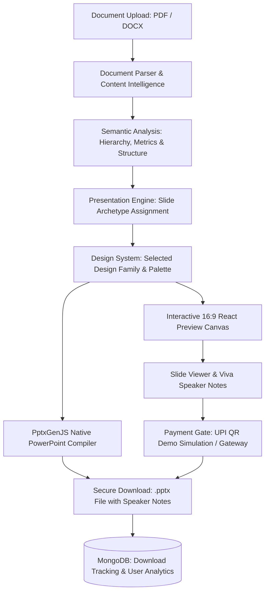

# 🧠 DeckMind AI — Presentation Intelligence Platform

<div align="center">


**Turn any complex engineering report, research paper, or document into an audience-aware, beautifully structured, and editable presentation deck.**

[Explore Features](#-key-features) • [System Architecture](#-system-architecture) • [Design Systems](#-12-distinct-design-families-52-templates) • [Getting Started](#-getting-started) • [Deployment](#-deployment-guide-vercel)

</div>

---

## 🌟 Overview

**DeckMind AI** is an advanced presentation intelligence platform built specifically for students, researchers, engineers, and professionals. Unlike standard AI tools that simply dump raw text paragraphs onto repetitive template cards, DeckMind AI uses a **3-Layer Intelligence Architecture**:

1. **Content Intelligence Engine**: Extracts semantic structure (Problem Statement, Solution Pillars, Architecture Diagrams, Process Flows, Benchmark Metrics, Hardware Matrices, and Viva Defense Q&As).
2. **Design Family System**: Maps content into 12 fundamentally distinct visual design families across 52+ professional presentation templates.
3. **100% Native PPTX Export**: Compiles slides into fully editable vector PowerPoint (`.pptx`) decks with matching typography, geometry, color palettes, and speaker notes.

---

## ✨ Key Features

### 📄 1. Intelligent Document Parsing
- **Format Support**: Ingests `.pdf` and `.docx` files up to 25 MB with zero data loss.
- **Deep Extraction**: Automatically identifies document titles, abstracts, methodology, architectural blocks, formulas, hardware specs, and conclusions.

### 🎨 2. 12 Distinct Design Families (52+ Templates)
Choose from fundamentally diverse visual philosophies:
- ⚡ **Neo-Brutalist & Memphis Pop**: High-contrast black outlines, bold drop shadows, and vibrant pop color palettes.
- 🌌 **Future Tech & Cyber Dark**: Glowing cyan accents, circuit borders, dark immersive cards.
- 🔮 **Aurora Gradient & Gradient Mesh**: Fluid ambient neon glows, glassmorphic panels, dynamic gradients.
- 🍱 **Bento Grid Hero**: Modular asymmetric information cards with high hierarchy.
- 📐 **Swiss Editorial & Zurich Red**: Minimalist, high-contrast typography and precise grid layout.
- 🎓 **Academic Research & Capstone**: Centered formal titles, serif headlines, structured IEEE/thesis badges.
- 📰 **Bold Magazine & Split-Hero**: Editorial split-panel layouts with dramatic typography.
- 🛠️ **Engineering Blueprint**: Technical grid background, monospace telemetry, and schematic borders.
- 📊 **Data Dashboard & Telemetry**: KPI metric counters, benchmark cards, and analytical gauges.
- 🍏 **Apple Minimal Canvas**: Crisp white space, refined typography, and subtle shadows.

### 📊 3. 10 Dynamic Visual Slide Archetypes
Every generated slide has its own bespoke layout structure:
- **Title / Hero**: 10 distinct hero architectures matching the selected design family.
- **Problem & Pain Points**: Split problem cards with impact metric badges.
- **Solution Pillars**: 3-column feature grids with accent header nodes.
- **Architecture Stack**: Layered multi-tier technical architecture diagrams.
- **Workflow & Process**: Linear step-by-step numbered pipelines.
- **Results & Benchmarks**: High-impact metric callouts and comparative graphs.
- **Hardware & Specs**: Spec comparison matrices and component tables.
- **Viva Defense Q&A**: Question & answer cards with faculty defense hints.
- **Roadmap & Milestones**: Chronological phases with status badges.
- **Conclusion & Takeaways**: Executive key takeaways with thank-you endcards.

### 📑 4. Viva Speaker Notes & Defense Assistant
- Generates detailed, slide-by-slide speaker notes.
- Anticipates examiner/faculty questions with prepared answers for project defenses.

### 💳 5. UPI Payment Simulation & Razorpay Support
- **UPI QR Code Modal**: Responsive, centered QR code payment section.
- **90-Second Demo Simulation**: Animated countdown with real-time transaction status tickers (*Processing*, *Confirming*, *Verifying*).
- **Automated Unlock**: Automatically marks simulated transactions as completed and unlocks the `.pptx` download button.
- **Razorpay Integration**: Production-ready gateway support for live card, NetBanking, and UPI settlements.

### 🛡️ 6. Role-Based Admin Dashboard
- Protected server-side route (`/admin`) requiring `admin` credentials.
- Real-time platform analytics:
  - Total registered users & recent profiles
  - Presentations generated across templates
  - PPT downloads & unique downloader conversion rates
  - Gross revenue tracking (UPI + Gateway)
  - Detailed download history & audit logs

---

## 🏗️ System Architecture



---

## 💻 Tech Stack

| Layer | Technology |
|---|---|
| **Framework** | [Next.js 16 (App Router)](https://nextjs.org/) with Turbopack |
| **Frontend UI** | [React 19](https://react.dev/), [Tailwind CSS v4](https://tailwindcss.com/), [Lucide React Icons](https://lucide.dev/) |
| **State & Context** | React Context API with SessionStorage rehydration |
| **Authentication** | [NextAuth.js v5 (Auth.js Beta)](https://authjs.dev/), [Bcryptjs](https://www.npmjs.com/package/bcryptjs) |
| **Database & ODM** | [MongoDB Atlas](https://www.mongodb.com/atlas) / Local MongoDB with [Mongoose 9](https://mongoosejs.com/) |
| **Document Parsing** | [pdf-parse](https://www.npmjs.com/package/pdf-parse), [mammoth](https://www.npmjs.com/package/mammoth) |
| **PPTX Generation** | [PptxGenJS v4](https://gitbrent.github.io/PptxGenJS/) |
| **Payment Support** | UPI QR Demo Simulation, [Razorpay Node SDK](https://razorpay.com/) |

---

## 📁 Project Structure

```text
deckmind-ai/
├── public/                     # Static assets (UPI QR code, icons, logos)
├── src/
│   ├── app/                    # Next.js App Router
│   │   ├── admin/              # Protected Admin Analytics Dashboard
│   │   ├── api/                # Backend API Routes
│   │   │   ├── admin/stats/    # Admin platform metrics API
│   │   │   ├── auth/           # NextAuth & registration endpoints
│   │   │   ├── parse-document/ # PDF & DOCX upload and parsing
│   │   │   ├── payments/       # Razorpay & UPI demo simulation APIs
│   │   │   └── presentations/  # Presentation save & PPTX download APIs
│   │   ├── create/             # 6-Step Presentation Studio Wizard
│   │   ├── dashboard/          # User Dashboard & File Upload Dropzone
│   │   ├── login/              # Sign In & Registration with Mode Tabs
│   │   ├── presentation/       # 16:9 Slide Canvas Preview & Viva Notes
│   │   ├── processing/         # Real-Time AI Generation Radar & Pipeline
│   │   ├── globals.css         # Tailwind CSS v4 & custom design utilities
│   │   └── layout.tsx          # Root Layout & Global Context Providers
│   ├── components/             # Modular React Components
│   │   ├── create/             # Stepper & parameter controls
│   │   ├── dashboard/          # Upload dropzones & recent decks
│   │   ├── landing/            # Landing page sections & showcases
│   │   ├── layout/             # Navbar, Footer, Sidebar, Header
│   │   ├── payment/            # PaymentModal & UPI QR Countdown Timer
│   │   ├── presentation/       # SlideViewer, SlideThumbnails, Notes
│   │   │   ├── slideLayouts/   # 10 Slide Archetype Layout Engines
│   │   │   └── slides/         # Slide component delegates
│   │   ├── processing/         # AIBrainRadar & Pipeline Tickers
│   │   ├── providers/          # AuthSessionProvider
│   │   ├── templates/          # Live 16:9 Template Preview & Gallery
│   │   └── ui/                 # Buttons, Badges, Modals, Sliders
│   ├── context/                # PresentationContext state management
│   ├── lib/
│   │   ├── auth/               # NextAuth configuration & Admin auto-seeding
│   │   ├── db/                 # MongoDB connection & Mongoose client abstraction
│   │   ├── engine/             # Semantic document-to-slide generator
│   │   ├── parser/             # PDF & DOCX client/server parsers
│   │   ├── pptx/               # PptxGenJS presentation compiler
│   │   └── templates/          # 12 Design Families & 52+ Template definitions
│   ├── models/                 # Mongoose Data Schemas (User, Presentation, Payment, DownloadHistory)
│   └── types/                  # TypeScript interfaces & definitions
├── .env.example                # Environment variables template
├── next.config.ts              # Next.js configuration
├── package.json                # Dependencies and build scripts
├── README.md                   # Project documentation
└── tsconfig.json               # TypeScript configuration
```

---

## 🚀 Getting Started

### Prerequisites
- **Node.js**: `v18.18.0` or higher (tested on Node `v20` / `v24`)
- **Package Manager**: `npm`, `pnpm`, or `yarn`
- **Database**: MongoDB (Local MongoDB instance or MongoDB Atlas cloud connection)

### 1. Clone the Repository
```bash
git clone https://github.com/ratanraj180/deckmind-ai.git
cd deckmind-ai
```

### 2. Install Dependencies
```bash
npm install
```

### 3. Configure Environment Variables
Create a `.env.local` or `.env` file in the root directory:

```bash
cp .env.example .env.local
```

Fill in your configuration:
```env
# Database Connection (Local or Atlas)
MONGODB_URI="mongodb://127.0.0.1:27017/deckmind"

# NextAuth Configuration
NEXTAUTH_SECRET="deckmind_ai_super_secret_local_dev_key_32_chars"
NEXTAUTH_URL="http://localhost:3000"
AUTH_TRUST_HOST="true"

# Admin Account Credentials
ADMIN_EMAIL="ratanas1408@gmail.com"
ADMIN_PASSWORD="Ratanas1408@gmail.com"

# Optional: Razorpay Payment Gateway (for live payments)
# RAZORPAY_KEY_ID="rzp_test_..."
# RAZORPAY_KEY_SECRET="..."
# NEXT_PUBLIC_RAZORPAY_KEY_ID="rzp_test_..."

# Optional: AI Provider Keys
# GEMINI_API_KEY="..."
# OPENAI_API_KEY="..."
```

### 4. Run the Development Server
```bash
npm run dev
```

Open [http://localhost:3000](http://localhost:3000) in your browser.

---

## 🔑 Default Admin Access

To access the platform's Admin Dashboard:
1. Navigate to [http://localhost:3000/login](http://localhost:3000/login)
2. Enter your Admin Credentials:
   - **Email**: `ratanas1408@gmail.com`
   - **Password**: `Ratanas1408@gmail.com`
3. Navigate to [http://localhost:3000/admin](http://localhost:3000/admin) to view real-time platform statistics, user lists, and download logs.

---

## 🧪 Testing & Quality Assurance

Run TypeScript verification:
```bash
npx tsc --noEmit
```

Run a production build:
```bash
npm run build
```

---

## 🌐 Deployment Guide (Vercel)

1. Push your repository to GitHub:
   ```bash
   git push origin main
   ```
2. Go to [vercel.com/new](https://vercel.com/new) and import `ratanraj180/deckmind-ai`.
3. In **Project Settings ➔ Environment Variables**, add:
   - `MONGODB_URI`: Your MongoDB Atlas cluster connection string (`mongodb+srv://...`)
   - `NEXTAUTH_SECRET`: A secure 32+ character string
   - `AUTH_TRUST_HOST`: `true`
   - `ADMIN_EMAIL`: `ratanas1408@gmail.com`
   - `ADMIN_PASSWORD`: Your admin password
4. Click **Deploy**. Vercel will build and deploy the application with zero configuration.

---

## 📜 License

This project is licensed under the MIT License.

---

<div align="center">

Made with ❤️ by **[Ratanraj](https://github.com/ratanraj180)** • DeckMind AI Team

</div>
